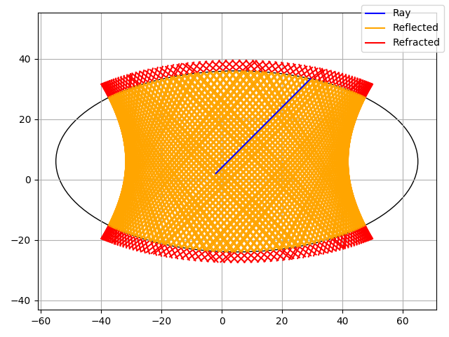

# Simple Ray Tracing
A Python application that performs simple ray tracing.




# Installation
**Debian based**
```bash
sudo apt-get install git python3.6 python3-pip python3.6-tk
pip3 install virtualenv
git clone https://github.com/pribavkindenis/simple-ray-tracing.git
cd ./simple-ray-tracing/
./install.sh
./run.sh
```
**Arch linux**
```bash
sudo packman install git python3.6 python3-pip python3.6-tk
pip3 install virtualenv
git clone https://github.com/pribavkindenis/simple-ray-tracing.git
cd ./simple-ray-tracing/
./install.sh
./run.sh
```
**OS X**
```bash
brew install git python3.6 python3-pip python3.6-tk
pip3 install virtualenv
git clone https://github.com/pribavkindenis/simple-ray-tracing.git
cd ./simple-ray-tracing/
./install.sh
./run.sh
```
