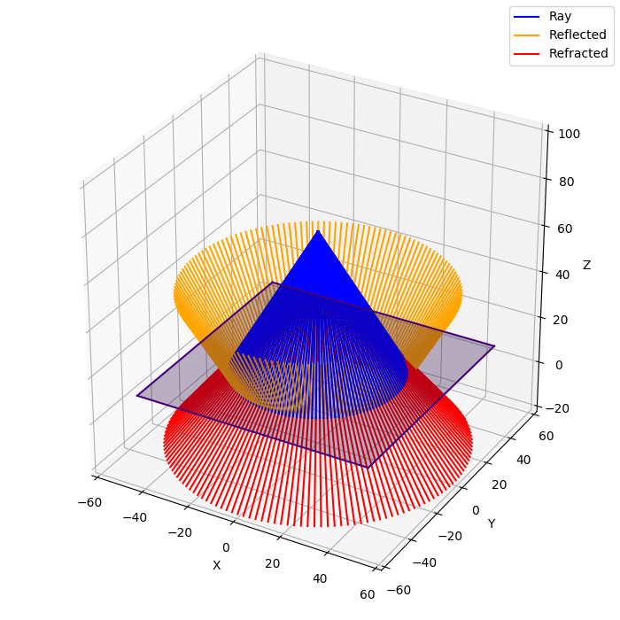

# Simple Ray Tracing
A Python application that performs simple ray tracing.




# Requirements
* python3
* virtualenv
* tkinter

# Launch

```bash
git clone https://github.com/pribavkindenis/simple-ray-tracing.git
cd ./simple-ray-tracing/
./install.sh
./run.sh
```